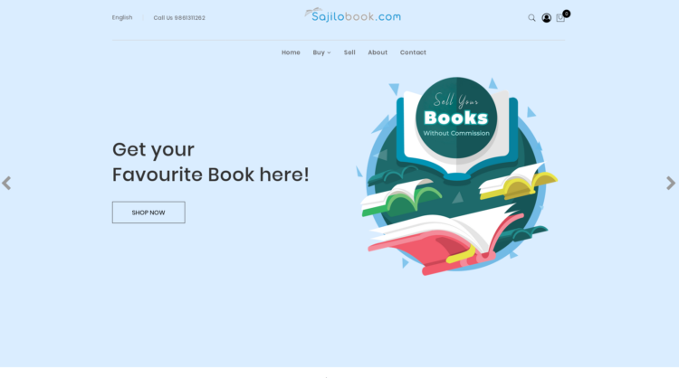
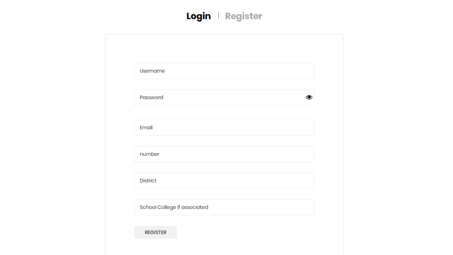

# Sajilobook-Completed

This website has been designed and developed for sajilobook online book buying and selling ecommerce industry. 
This website is fully responsive and is designed using plain Html, CSS, Javascript, and Jquery in the frontend and python framework Django in the backend.

This website has an additional admin panel so that the admin/owner of the industry can control the verious functionalities. 

The users need to create an account and login with that account in order to checkout with their orders in the cart. 
The registered password for the username is stored in the hash form and thus is not readable by the admin.

